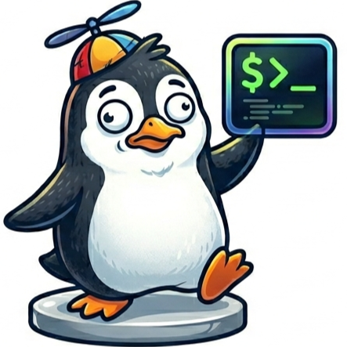

# 🚀 NoobTerm

**NoobTerm** is a high-performance, cross-platform terminal emulator built with **Wails**, **Go**, and **React**. Designed for developers who want a fast, aesthetically pleasing, and workspace-aware terminal experience without the complexity.



## ✨ Features

- **🚀 Performance-First:** Built on the same rendering engine as VS Code (XTerm.js) with optional WebGL acceleration.
- **📁 Workspace Management:** Organize your terminal sessions into persistent workspaces.
- **📊 Real-time Monitoring:** Integrated CPU and Memory monitoring for every active terminal session.
- **🎨 Modern UI:** Sleek, customizable themes (Pro, Joy, and Standard) with smooth transitions.
- **🪟 Cross-Platform:** Native performance on Windows, Linux, and macOS.
- **🔄 Git Integration:** Automatically tracks and displays the active Git branch for your workspaces.
- **🛠️ Command Palette:** Quick access to common actions and configuration.

## 🛠️ Tech Stack

- **Backend:** [Go](https://go.dev/) (powered by [Wails v2](https://wails.io/))
- **Frontend:** [React](https://reactjs.org/), [TypeScript](https://www.typescriptlang.org/)
- **Terminal Core:** [XTerm.js](https://xtermjs.org/)
- **Bundler:** [Vite](https://vitejs.dev/)

## 🚀 Getting Started

### Prerequisites

- **Go:** 1.23 or higher
- **Node.js:** 24 or higher
- **Wails CLI:** `go install github.com/wailsapp/wails/v2/cmd/wails@latest`

### Local Development

1. Clone the repository:
   ```bash
   git clone https://github.com/DJ5harma/NoobTerm.git
   cd NoobTerm
   ```

2. Run in development mode:
   ```bash
   wails dev
   ```
   This will launch the application with hot-reloading enabled for both Go and React code.

### Building for Production

To build a standalone executable for your current platform:

```bash
wails build -clean
```

For **Linux**, ensure you have the required dependencies:
```bash
sudo apt-get install libgtk-3-dev libwebkit2gtk-4.1-dev libayatana-appindicator3-dev pkg-config build-essential
```

## 📦 Distribution & CI/CD

NoobTerm uses a robust GitHub Actions pipeline to deliver native binaries for all major platforms:

- **Windows:** `.exe` standalone and NSIS Installer.
- **macOS:** Universal `.app` (Intel & Apple Silicon) bundled as `.zip`.
- **Linux:** Native binary bundled as `.tar.gz`.

To trigger a release, simply push a version tag (`v1.0.0`) or run the **Build & Release** workflow manually from the Actions tab.

## 🤝 Contributing

Contributions are welcome! Please feel free to submit a Pull Request.

1. Fork the Project
2. Create your Feature Branch (`git checkout -b feature/AmazingFeature`)
3. Commit your Changes (`git commit -m 'Add some AmazingFeature'`)
4. Push to the Branch (`git push origin feature/AmazingFeature`)
5. Open a Pull Request

## 📄 License

Distributed under the MIT License. See `LICENSE` for more information.

---
Built with ❤️ by [DJ5harma](https://github.com/DJ5harma)
